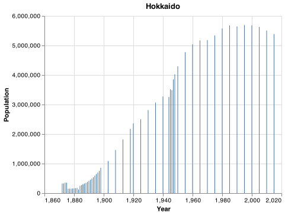
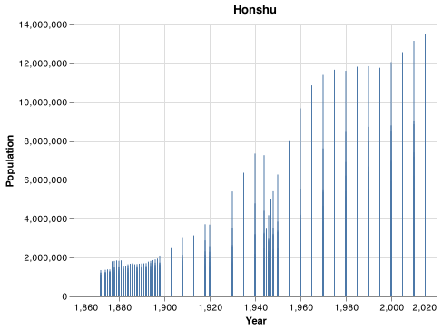
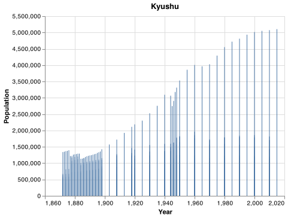
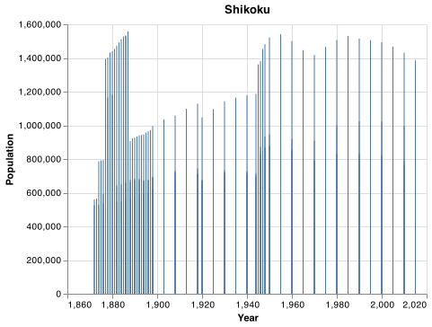
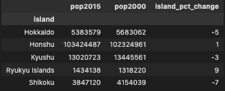

# Japan Exploration
__Course CSE 310__
__21 May 2022__
__James Rainey__

# Introduction


### Japan has a declining population. There are a variety of factors involved that contribute to this phenomenon, most of which go above and beyond the scope of this project. But does the declining population have an effect on housing/real estate prices? By analyzing two different datasets, I hope to gain insight into this question. 


### Question 1: 
#### How much is Japan's population declining? 
First, let us examine Japan's population. As of May 2022, Japan's population stands at roughly 125,750,000 people. 

For our dataset, the data stretches back to the 1870s yet doesn't contain any population data past 2015. With the knowledge that Japan's population is in decline, can we see a decline just from 2015?

Based on the dataset, Japan's population as of 2015 was made up of 127,110,047 people. Ignoring the differences between what month the data was taken, that is a decline from 2015 to 2022 of approximately 1%. 

### Question 2:
# What does the population history look like on all the four largest islands of Japan?

#### Hokkaido


#### Honshu


#### Kyushu



#### Shikoku



### Here is a Table showing the rounded percent change in population in all 4 major islands from 2000 to 2015



# Much more can be done with these datasets, but that's all for now!


## APPENDIX A (PYTHON CODE)
```python
#%%

#importing libraries
import pandas as pd   
import altair as alt   
import altair_saver as alt_s
from altair import datum
import os
import numpy as np

#%%

#importing csv data to first data_set, japan_pop
japan_pop = pd.read_csv("CSVFILES/Japan_population_data.csv")


# %%

#check japan_pop data

japan_pop.head()

#%%
#year and population are both float, which would complicate calculations. I will convert them both to int

# converting 'Weight' from float to int
japan_pop['year'] = japan_pop['year'].astype(int)


#%%
# check whether datatypes are converted
display(japan_pop.dtypes)


#%%
# Import a different dataset into a new dataframe called japan_price. This was quite a challenge because there were 47 csv files for the dataset. I don't think I'll end up using it in this data analysis project because the timeframes are different. 


filesnames = os.listdir('CSVFILES/trade_prices')
filesnames = [f for f in filesnames if f.lower().endswith(".csv")]
print(filesnames)


japan_price = pd.read_csv(f'CSVFILES/01csv/01.csv')

for filename in filesnames:
     df = pd.read_csv(f'CSVFILES/trade_prices/{filename}')
     japan_price.append(df)


# %%

#check japan_price data

japan_price.head()
display(japan_price.dtypes)


# %%
#query japan's population in the year of 2015

twenty15 = japan_pop.query('year == 2015')

#%%
# sort all prefectures by population, in descending order
prefecture_pop_2015 = (twenty15
    .groupby(['prefecture']).sum()
    .filter(['population'])
    .sort_values('population',ascending=[False] ))

prefecture_pop_2015.to_markdown()

# %%
#sum japans population in the year of 2015
pop_2015 = twenty15['population'].sum()
pop_2015
# %%


# %%
# %%
#Create a new column called pct_pop_change that calculates the percentage change of population 
japan_pop['pct_pop_change'] = japan_pop['population'].pct_change()
japan_pop


 
# %%
island_groupby = japan_pop.groupby(['island'])
island_groupby.head()

# %%
#examine only the data with island == hokkaido
hokkaido = japan_pop.query('island=="Hokkaido"')
print(hokkaido)

# %%
#examine only the data with island == hokkaido
honshu = japan_pop.query('island=="Honshu"')
print(honshu)

# %%

kyushu = japan_pop.query('island=="Kyushu"')


# %%

shikoku = japan_pop.query('island=="Shikoku"')

#Examine japan_pop with new hokkaido filter 

hokkaido_2015 = hokkaido.query('year==2015.0000')

hokkaido_2015.head()

# %%
#Create 4 bar charts in the map folder of the population of Japan from the 1870s to 2015 

chart = alt.Chart(hokkaido).properties(title="Hokkaido").encode(
    x=alt.X('year', title = "Year"),
    y=alt.Y('population',title = "Population"),
).mark_bar(size=1)
chart.save("MAPS/hokkaido.png")

chart2 = alt.Chart(honshu).properties(title="Honshu").encode(
    x=alt.X('year', title = "Year"),
    y=alt.Y('population',title = "Population"),
).mark_bar(size=1)
chart.save("MAPS/honshu.png")


chart3 = alt.Chart(kyushu).properties(title="Kyushu").encode(
    x=alt.X('year', title = "Year"),
    y=alt.Y('population',title = "Population"),
).mark_bar(size=1)
chart.save("MAPS/kyushu.png")


chart4 = alt.Chart(shikoku).properties(title="Shikoku").encode(
    x=alt.X('year', title = "Year"),
    y=alt.Y('population',title = "Population"),
).mark_bar(size=1)
chart.save("MAPS/shikoku.png")
# %%
# calculate the increase or decrease of the population of each major japanese island from 2000 to 2015

pop_2000 = (japan_pop[japan_pop.year==2000]
    .groupby(['island']).population.sum()
    .sort_index(ascending=[False] )).rename("pop2000")


pop_2015 =(japan_pop[japan_pop.year==2015]
    .groupby(['island']).population.sum()
    .sort_index(ascending=[False] )).rename("pop2015")

pop_2000.head()

pct_change_dataset = pd.concat([pop_2015,pop_2000], axis=1)

pct_change_dataset['pct_change'] = (a.pop2015 - a.pop2000) / a.pop2000 * 100
pct_change_dataset.to_markdown()
```